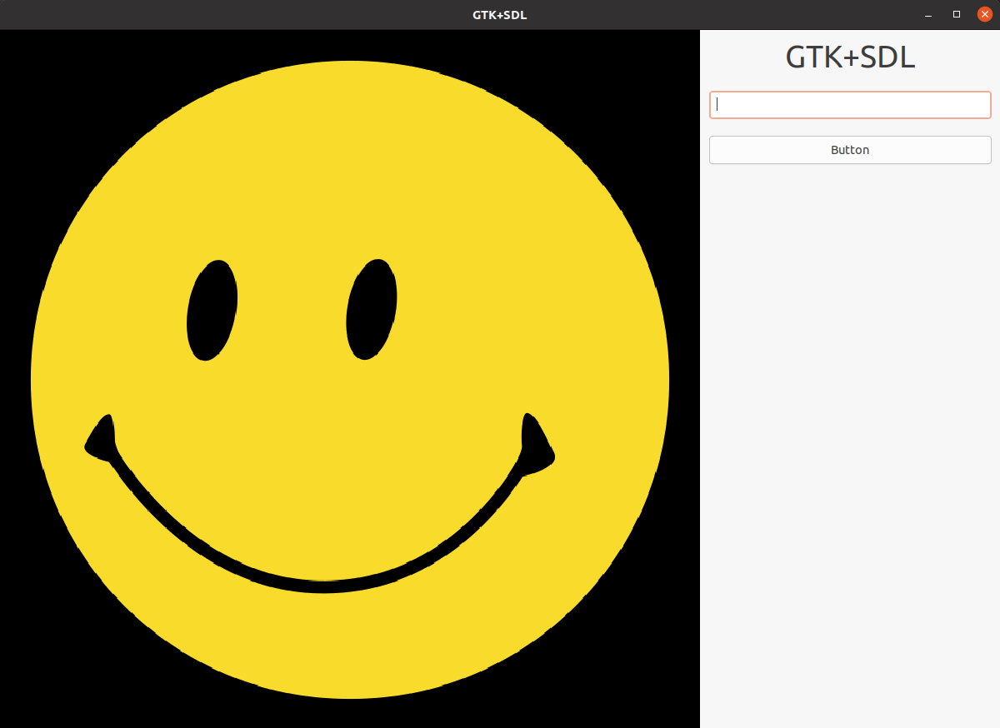

# GTK-SDL2

GTK-SDL2 is a simple integration example of GTK+ 3.0 and SDL2 in the C programming language. I decided to make a separate repository with this based on [Martians](https://github.com/AlejandroIbarraC/Martians) because I had a hard time figuring out how to run these two GUI frameworks in the same window. This example is a mixture of ideas and code snippets I found on the internet, heavy organization of elements and a neat frame rendering idea from [kevinscorzu](https://github.com/kevinscorzu)'s CrazyAnts.

What this does is it creates a SDL window, embeds it in a GTK+ window and calls for its renderer using the native GTK function idle(). This allows for simultaneous display of both frameworks' graphical elements on the same window. I have no idea why you'd want or need to create a UI of this type using C, maybe for a college project like in my case. However, if you're allowed to choose languages and frameworks, I'd suggest you choose at least C++ as many cool UI frameworks are written for that language like Qt. Handling labels, entries and buttons requires more lines of code in C and can get pretty overwhelming.

The example includes a background image rendered in a SDL window. The SDL elements are easily accesible from the main code and you can add more stuff by checking the official SDL documentation. The GTK window is drawn on the right side and includes a main title label example, a simple entry and a button that prints its contents on console. I also included a onCLick function to register key input using GTK.

## Photos 📷

Main UI        
:------------------------------:|
  

### Prerequisites 👓

Software you need to install to run this project:

```
C version 23
C libraries: SDL2, SDL2 Image, gtk+ 3.0
```

### Compiling 💻

Run the included **Makefile** with the default *make* command. Make sure to install all dependencies, especially SDL2 and SDL2 image, which can sometimes be tricky to configure. This creates an executable file called *main* in the src folder that can be opened with *./main*

It's also possible to open the project using an IDE like CLion, that can read the included CMakeLists.txt file. This way is much easier for testing and debugging in my opinion, but it depends on your setup.

## Authors 👨🏻‍💻

* **Alejandro Ibarra** - *Developer & Designer* - [AlejandroIbarraC](https://github.com/AlejandroIbarraC)

## License 📄

This project is licensed under the MIT License - see the [LICENSE.md](LICENSE.md) file for details

## Acknowledgments 📎

* Kevin Cordero - [kevinscorzu](https://github.com/kevinscorzu)

<p align="center">J.A Ibarra. 2022</p
```

